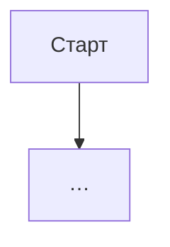
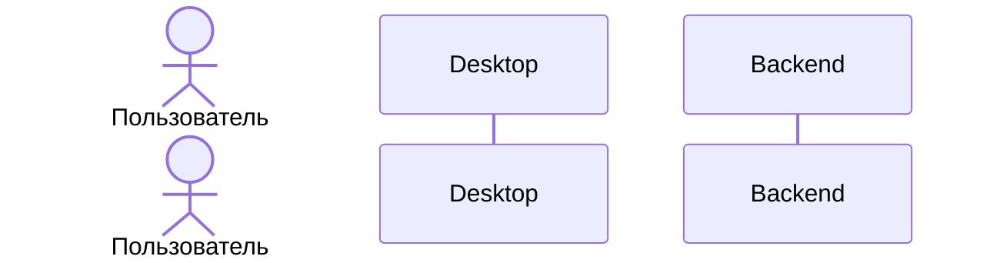

# {Название фичи} — системная спецификация

| Поле | Значение |
|------|----------|
| **ID** | AI-{XXX} |
| **Назначение** | SA-спецификация фичи AI_algo / IT Algo Desktop |
| **Репозиторий** | `AI_algo` (+ интеграция в `it-algo-desktop` / `it-algo-site` при необходимости) |
| **Статус** | Черновик / В разработке / Релиз {version} |
| **Родитель** | [PRODUCT_VISION.md](../PRODUCT_VISION.md) |
| **Связанные фичи** | F-… |

---

## Содержание

1. [Контекст](#1-контекст)
2. [Бизнес-цель](#2-бизнес-цель)
3. [Пользовательские сценарии (UC)](#3-пользовательские-сценарии-uc)
4. [Бизнес-требования](#4-бизнес-требования)
5. [Описание: процесс и техническая реализация](#5-описание-процесс-и-техническая-реализация)
6. [Функциональные требования](#6-функциональные-требования)
7. [Нефункциональные требования (NFR)](#7-нефункциональные-требования-nfr)
8. [Архитектурные решения (ADR)](#8-архитектурные-решения-adr)
9. [API и контракты](#9-api-и-контракты)
10. [Матрица исходов](#10-матрица-исходов)
11. [Зависимости и релиз](#11-зависимости-и-релиз)
12. [Открытые вопросы](#12-открытые-вопросы)

> **Релизные тексты** (`releases/*.json`): title, highlights, changes — **на русском языке**.

---

## 1. Контекст

Кратко: зачем фича, AS-IS, ограничения, связь с продуктом.

---

## 2. Бизнес-цель

Одна формулировка цели + измеримый результат (если есть).

---

## 3. Пользовательские сценарии (UC)

| UC | Актор | Цель | Предусловия |
|----|-------|------|-------------|
| UC-01 | … | … | … |

### UC-01 — {название}

---

## 4. Бизнес-требования

| ID | Требование | Приоритет |
|----|------------|-----------|
| BR-01 | … | Must |

---

## 5. Описание: процесс и техническая реализация

### 5.1 AS-IS

### 5.2 TO-BE

### 5.3 Поток данных

### 5.4 Затронутые компоненты

| Слой | Путь / модуль |
|------|----------------|
| UI | `src/…` |
| Tauri | `src-tauri/…` |
| Backend | `it-algo-site/backend/…` |

---

## 6. Функциональные требования

| ID | Требование | Проверка |
|----|------------|----------|
| FR-01 | … | … |

---

## 7. Нефункциональные требования (NFR)

| ID | Категория | Требование |
|----|-----------|------------|
| NFR-01 | Безопасность | … |
| NFR-02 | Производительность | … |
| NFR-03 | UX | … |

---

## 8. Архитектурные решения (ADR)

| ID | Решение | Альтернативы | Обоснование |
|----|---------|--------------|-------------|
| ADR-01 | … | … | … |

---

## 9. API и контракты

| Метод | Endpoint | Назначение |
|-------|----------|------------|

---

## 10. Матрица исходов

### Success (S)

| ID | Условие | Результат |
|----|---------|-----------|

### Exception (E)

| ID | Условие | HTTP / код |
|----|---------|------------|

---

## 11. Зависимости и релиз

| Зависимость | Тип |
|-------------|-----|
| F-… | Блокер / soft |

**Версия релиза:** `v{x.y.z}`  
**CI/CD:** TBD (AI_algo docs-first; Desktop — свой release process)  
**Release manifest:** N/A в AI_algo; при поставке в Desktop — manifest Desktop

---

## 12. Открытые вопросы

| # | Вопрос | Владелец |
|---|--------|----------|
