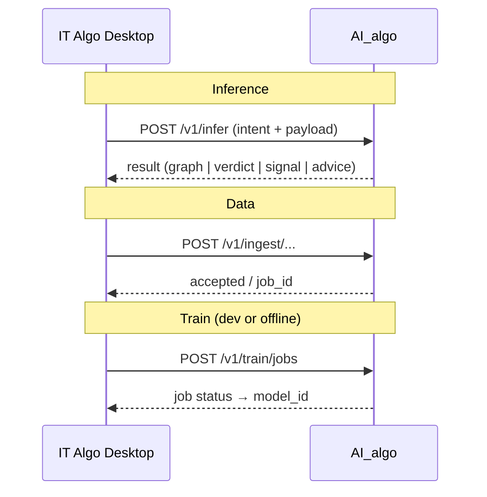

# AI_algo — интерфейсы подключения (integration contracts)

| Поле | Значение |
|------|----------|
| **ID** | AI-PLATFORM-IFACE |
| **Статус** | Черновик контракта |
| **Дата** | 2026-08-20 |
| **Продукт** | AI_algo (отдельный) |
| **Клиент v1** | it-algo-desktop |
| **Связано** | [PRODUCT_BOUNDARY.md](../../PRODUCT_BOUNDARY.md), [TRAINING_APPROACH.md](../../TRAINING_APPROACH.md), [BACKLOG.md](../BACKLOG.md) |

---

## 1. Цель

Описать **стабильные интерфейсы**, через которые IT Algo (и позже другие клиенты):

1. **передаёт данные** в AI_algo (рынок, ноды/граф, метрики, контекст пользователя);
2. **получает ответы** (сборка скрипта, compare, совет, сигнал);
3. **кормит обучение** — либо выгрузкой, либо интеграцией в **dev**-контуре.

Транспорт MVP: HTTPS JSON (локальный процесс или remote). Позже: gRPC / native FFI — тот же logical contract.

---

## 2. Высокоуровневые поверхности

| Поверхность | Направление | Назначение |
|-------------|-------------|------------|
| **Inference API** | Client → AI → Client | Запросы «ответь / собери / сравни / сигнал» |
| **Data Ingest API** | Client → AI | Передача баров, фич, графов, результатов бэктеста |
| **Train Control API** | Dev/CI → AI | Старт/статус обучения, регистрация датасета |
| **Model Registry** (внутр.) | AI | Версии моделей, feature schema |
| **Health / Capabilities** | Client → AI | Что умеет инстанс, версии контракта |



---

## 3. Общий конверт запроса / ответа

### 3.1 Request envelope

```json
{
  "api_version": "2026-08-20",
  "request_id": "uuid",
  "client": {
    "product": "it-algo-desktop",
    "app_version": "0.x.y",
    "env": "prod|dev"
  },
  "auth": { "type": "bearer|device|dev", "token": "…" },
  "intent": "build_script|compare_scripts|advise|signal|ingest|train",
  "payload": {}
}
```

### 3.2 Response envelope

```json
{
  "api_version": "2026-08-20",
  "request_id": "uuid",
  "status": "ok|error|accepted",
  "model": { "id": "signal-cpu-v3", "kind": "lgbm|llm_pipeline|rules" },
  "result": {},
  "warnings": [],
  "error": null
}
```

**Правило:** цифры в `result` для compare/advise — только те, что пришли в payload или посчитаны детерминированно; LLM не выдумывает метрики.

---

## 4. Inference — ответы нейросети / AI-слоя

Базовый путь: `POST /v1/infer` с разным `intent`.

### 4.1 `build_script` — сборка / дозаполнение графа

**Вход (payload):**

| Поле | Тип | Обязательно | Описание |
|------|-----|-------------|----------|
| `prompt` | string | да* | Текст пользователя (*или `partial_graph`) |
| `regime_hint` | `trend\|mr\|breakout\|auto` | нет | Подсказка режима |
| `symbol` / `timeframe` | string | желательно | Контекст |
| `partial_graph` | GraphDTO | нет | Уже нарисованные ноды |
| `constraints` | object | нет | max узлов, whitelist, запреты |

**Выход:**

| Поле | Описание |
|------|----------|
| `graph` | GraphDTO — валидный граф под контракт DSL |
| `assumptions[]` | Что додумали (периоды, EMA(RSI), …) |
| `validation` | ok / errors[] |

### 4.2 `compare_scripts` — лучше / хуже

**Вход:**

| Поле | Описание |
|------|----------|
| `before` | `{ graph?, backtest_metrics, run_meta }` |
| `after` | то же |
| `align` | период, symbol, комиссия — должны совпадать |

`backtest_metrics` (минимум): `pnl`, `max_dd`, `winrate`, `trades`, `sharpe?`, …

**Выход:**

| Поле | Описание |
|------|----------|
| `verdict` | `better\|worse\|mixed` |
| `metrics_diff` | посчитанный diff |
| `commentary` | текст |
| `suggestions[]` | 1–3 совета с опорой на метрики |

### 4.3 `advise` — портфель / скрипт

**Вход:** агрегированная статистика портфеля и/или скриптов.  
**Выход:** `recommendations[]` + `facts_used[]` (ссылки на переданные метрики).

### 4.4 `signal` — контур A

**Вход:**

| Поле | Описание |
|------|----------|
| `feature_vector` | map имя→число **или** |
| `bars` + `feature_spec_id` | AI считает фичи сам (если умеет) |
| `model_id` | опционально pin версии |

**Выход:**

| Поле | Описание |
|------|----------|
| `p` / `label` | вероятность / класс |
| `regime` | опционально |
| `feature_schema_id` | для трассировки |
| `disclaimer` | сигнал ≠ гарантия прибыли |

---

## 5. Data — передача данных в AI_algo

### 5.1 Рыночные данные / фичи

`POST /v1/ingest/bars`

```json
{
  "dataset_id": "optional-or-server-assigned",
  "symbol": "SBER",
  "timeframe": "5m",
  "bars": [
    { "ts": "…", "open": 0, "high": 0, "low": 0, "close": 0, "volume": 0 }
  ],
  "indicators": [
    { "ts": "…", "rsi_14": 55.2, "ema_5_of_rsi_14": 54.1 }
  ]
}
```

Либо файлный контракт (export): Parquet/CSV с той же схемой → `POST /v1/ingest/datasets` (multipart) или drop в `data/raw/` в offline-режиме.

### 5.2 Ноды / граф скрипта (GraphDTO)

Канон для обучения B и для build/compare:

```json
{
  "graph_id": "…",
  "version": 3,
  "nodes": [
    {
      "id": "n1",
      "type": "indicator",
      "kind": "RSI",
      "params": { "period": 14 },
      "source": "close"
    },
    {
      "id": "n2",
      "type": "indicator",
      "kind": "EMA",
      "params": { "period": 5 },
      "source_node": "n1"
    },
    {
      "id": "n3",
      "type": "condition",
      "op": ">",
      "left": "n2",
      "right": 80
    }
  ],
  "edges": […],
  "meta": { "regime": "trend", "symbol": "SBER", "timeframe": "5m" }
}
```

`POST /v1/ingest/graphs` — одна или пакет версий (для датасета сборки / compare history).

### 5.3 Результаты бэктеста / live-статы

`POST /v1/ingest/runs`

```json
{
  "run_id": "…",
  "graph_id": "…",
  "graph_version": 3,
  "kind": "backtest|paper|live",
  "window": { "from": "…", "to": "…" },
  "metrics": { "pnl": 0, "max_dd": 0, "winrate": 0, "trades": 0 },
  "align_key": "symbol+tf+commission+window"
}
```

Нужно для compare и для обучения ранжировщика графов.

---

## 6. Обучение — два пути

### 6.1 Path Export (основной для prod-данных)

```text
Desktop / CI
  → выгрузка bars + indicators + graphs + runs
  → файлы или Ingest API
  → AI_algo Train job (offline)
  → model artifact → Registry
  → Desktop обновляет model_id / тянет бандл
```

Плюсы: изоляция, воспроизводимость, не грузит prod UI.  
Минусы: задержка цикла.

### 6.2 Path Dev-integrated

```text
it-algo-desktop @ branch dev
  ↔ AI_algo @ dev (localhost или staging)
  → периодический ingest из живой сессии / тестового бэктеста
  → Train Control API
  → быстрая итерация фич/меток
```

Правила:

- Только `client.env = dev` (или явный feature-flag).
- Не писать веса обратно в prod Registry без ручного promote.
- Секреты брокеров **никогда** не уходят в AI_algo — только рыночные ряды и графы.

`POST /v1/train/jobs`

```json
{
  "dataset_ids": ["…"],
  "loop": "A_signal|B_ranker",
  "label_spec": { "horizon_bars": 10, "epsilon": 0.001 },
  "feature_spec_id": "v1-basic",
  "split": "walk_forward"
}
```

`GET /v1/train/jobs/{id}` → `queued|running|succeeded|failed` + `model_id` + metrics OOS.

---

## 7. Capabilities & health

`GET /v1/health` → uptime, build  
`GET /v1/capabilities`

```json
{
  "api_version": "2026-08-20",
  "intents": ["build_script", "compare_scripts", "advise", "signal"],
  "models": [{ "id": "signal-cpu-v3", "kind": "lgbm" }],
  "composition": { "max_depth": 2, "whitelist": ["MA(ind)", "HTF_filter"] },
  "train": { "enabled": true, "env_only": ["dev"] }
}
```

Desktop при старте (или по кнопке AI) читает capabilities и прячет недоступные intent’ы.

---

## 8. Ошибки (черновик)

| Код | Когда |
|-----|--------|
| `validation_failed` | граф/фичи не по схеме |
| `align_mismatch` | compare на разных окнах |
| `model_unavailable` | нет модели / несовместимый feature_schema |
| `quota_exceeded` | лимит запросов |
| `train_forbidden_in_prod` | train из prod клиента |
| `unsupported_intent` | старый клиент / новый AI |

---

## 9. Версионирование контракта

- `api_version` в каждом запросе (дата или semver).
- GraphDTO и feature_schema — отдельные version id.
- Ломающие изменения → новый `api_version`; Desktop пинит совместимую.

---

## 10. MVP среза интерфейсов (предложение)

| # | Что | Зачем |
|---|-----|--------|
| 1 | `health` + `capabilities` | подключение |
| 2 | `ingest/bars` + `ingest/runs` + GraphDTO | данные |
| 3 | `infer/compare_scripts` | must-have UX |
| 4 | Export → train A offline | первая своя модель |
| 5 | `infer/signal` | отдать сигнал в Desktop |
| 6 | `infer/build_script` | конструктор |
| 7 | Dev train API | ускорение итераций |

---

## 11. Открытые вопросы

| # | Вопрос |
|---|--------|
| 1 | AI_algo process: sidecar local / cloud only / hybrid? |
| 2 | Auth между Desktop и AI (device token vs API key)? |
| 3 | GraphDTO = 1:1 с React Flow Desktop или отдельный canonical DSL? |
| 4 | Считать фичи в Desktop или в AI_algo? |
| 5 | Promote модели: ручной gate в prod? |
| 6 | Нужен ли websocket для длинных train/build job? |

---

## 12. Следующие артефакты

- [x] OpenAPI skeleton — [`openapi/v1.yaml`](../../../openapi/v1.yaml)
- [x] JSON Schema envelope — [`schemas/envelope.request.json`](../../../schemas/envelope.request.json), [`schemas/envelope.response.json`](../../../schemas/envelope.response.json)
- [ ] JSON Schema: GraphDTO, metrics, feature_vector  
- [ ] SA-спека `AI-PLATFORM` (этот документ → SA)  
- [ ] Адаптер-задача в it-algo-desktop (после стабилизации контракта)
